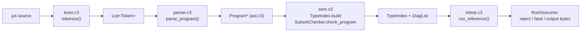

# Frontend pipeline walkthrough: lexer → parser → sem → interp

How `p4c3` turns a `.p4` file into a reference packet-transform result.
Sources: `src/lexer.c3`, `src/ast.c3`, `src/parser.c3`, `src/sem.c3`,
`src/interp.c3`, `src/main.c3`. Semantics pinned by `docs/v0-subset.md`.

## 1. `lexer.c3` — text → `List{Token}`

Not a streaming lexer: `tokenize()` scans the whole source up front into a
token list; the parser then works on an index cursor.

- **Trivia**: whitespace, `//`, `/* */`, and `#`-to-end-of-line — the last
  one is why `#include` lines vanish before parsing.
- **Numbers are P4 literals**: `scan_number` handles width prefixes
  (`16w0x8100`, `8w0b101`) and `0x/0b/0o` bases. Width digits are lexed as
  part of the INTEGER token text; `interp.c3:parse_uint_lit` splits them
  later.
- **Deliberate quirk**: the lexer emits each `>` as its own token, never
  `>>`. The parser glues two *adjacent* GTs back into RSHIFT in `scan_op`
  (checking line/column adjacency). This is what makes nested type args
  parseable: `tuple<bit<16>>` closes `bit<16>` and leaves the outer `>` —
  merging `>>` at lex time would break that.
- No keyword token kinds. `Token.is_kw(name)` just compares text against
  IDENT; the parser dispatches with `check_kw("extract")` etc. Simpler lexer,
  slightly more parser work.
- Errors: the `fail` macro records `error_msg/line/column` and raises the
  `PARSE_FAILED~` excuse (C3 fault). One excuse type serves both lexer and
  parser.

## 2. `ast.c3` + `parser.c3` — tokens → `Program*`

**AST shape** (`ast.c3`): tag-enum + fat-struct style. `Decl` is a single
fat struct covering all ten declaration kinds — whichever list is relevant
gets filled (`fields` for headers, `states` for parsers, `table`/`action`
for control-locals). `Expr` carries its source `Token` (so diagnostics need
no side table), plus `type`/`type_args` used only for CAST and method type
args (`packet.lookahead<ipv4_t>()`). Everything arena-allocated from one
allocator.

**Parser mechanics** (`parser.c3`):

- Cursor-based recursive descent: `peek/peek_at/advance`, `expect`, and the
  same first-error-wins `fail` macro as the lexer (`Parser.fail` keeps only
  the *first* error, which is what makes backtracking below safe).
- **The parser has no symbol table** — pure syntax. That forces a few
  speculation tricks:
  - `looks_like_var_decl` → `try_consume_type` parses a candidate type
    *speculatively* (saving/restoring `pos` and error state) to disambiguate
    `bit<16> x = ...;` from an expression statement.
  - `looks_like_call_type_args` scans up to 64 tokens ahead for `<...>(` to
    distinguish `foo<T>(x)` from `a < b > (c)`.
- Expressions: precedence climbing, `parse_binop(11)` down to unary. Only
  *builtin* casts are recognized (`bit<W>`, `int<W>`, `bool`) — the comment
  at `parse_unary` says why: named-type casts are ambiguous without a symbol
  table, so they're left out.
- Tolerance features: `skip_annotations` (`@name(...)`), `skip_balanced` for
  `extern`/`error`/`package` bodies — preambles parse without understanding.
- Structural parsing is straightforward: `parse_type` (widths + optional
  stack `[N]`), `parse_state` (statements + mandatory `transition`),
  `parse_table` (key/actions/size/default_action by keyword),
  `parse_control_decl`, and `parse_program` as the top-level keyword
  dispatch.
- Entry points `parse_source`/`parse_file` — used by both `cmd_dump` and
  `cmd_runref`.

## 3. `sem.c3` — index + v0 gate

Two distinct jobs, both consumed by the interpreter:

**`TypeIndex`** — the only "symbol table" in the project: headers, structs
(typedefs counted as structs), parsers, controls, consts, with name finders.
Parser/control *locals* are hoisted in (`add_locals`). It also owns the
**layout math**, which encodes the byte-oriented v0 rule:
`header_fixed_size` sums `bit<W>/8` (varbit contributes 0),
`header_field_offset` computes byte offsets with varbit fields sitting at the
end of the fixed part. Both the interpreter and (later) the codegen consume
these — one definition of wire layout.

**`SubsetChecker`** — the v0 gate implementing the "subset boundary" rule
from `docs/v0-subset.md` §2: out-of-subset programs get a diagnostic, never
silent degradation. Concretely:

- Headers: only byte-aligned `bit<W>` and `varbit<W>`. Structs: only header
  instances and byte-aligned `bit<W>`.
- `action`/`table` declarations → rejected outright; tables inside controls
  → rejected.
- Parser/control statements: statement-level whitelist via
  `parser_call_allowed` — only `packet.extract/extract_end/lookahead` and
  `setValid/setInvalid/isValid`.
- Parser transitions: NAME/SELECT targets must resolve to a defined state or
  `accept`/`reject`.
- Deparser detection: a control with a `packet_out` parameter
  (`control_is_deparser`). Deparser body must be a straight-line emit
  sequence: only `emit(x)` calls, no return/exit. `check_emit_call` builds a
  path key (`expr_path`, with a literal `[i]` for indices) and rejects
  **duplicate emits of the same instance** — value-version modeling is
  explicitly out of v0.

What sem.c3 deliberately is *not*: a full type checker (no name resolution
in expressions, no const folding — that's §5 step 2). It only builds the
index and enforces the subset boundary.

## 4. `interp.c3` — the oracle

Header comment states the design contract: **all runtime values are
big-endian byte strings; arithmetic normalizes to 8-byte ulongs.** Since v0
fields are byte-aligned, there is no bit-packing anywhere — `CAST` just
truncates or zero-left-pads to `width/8`.

**Runtime model**:

- `HdrInst {valid, type, data}` — `data` is fixed part followed by varbit
  content, so extract/emit are list copies.
- `StructStore` roots keyed by **type name**, not param name: `bind_params`
  maps struct params onto shared stores, so the parser's out-param and the
  deparser's in-param of the same struct type alias each other exactly as P4
  semantics require. It also records the `packet_in`/`packet_out` **param
  names** — method dispatch matches on the name, not the type (pragmatic,
  since the index knows `packet_in` only as a NAME type ref).
- `Ref` — the unified lvalue: whole header, field slice
  (`field_off`/`field_width` into a byte buffer), flat metadata field, whole
  stack, plus `via_next` so `extract` on `.next` advances `stack_next`.

**Key semantic points** (each pinned by a fixture in
`test/refmodel_test.c3`):

- `resolve_path`: locals shadow roots; `.next`/`.last` via `stack_next`;
  stack overflow/underflow and stack index OOB → `rejected` (a *behavior*,
  not an error).
- `extract_bytes` is **the single place the short-packet rule lives**:
  `cursor + n > packet.len` → `rejected + stopped`, and everything
  downstream unwinds through the `stopped` flag rather than faulting.
  `extract_end_bytes` reuses it and implements append-on-valid /
  replace-on-invalid.
- `eval_call` dispatches the six whitelisted methods. `lookahead` with a
  header type arg sizes via `header_fixed_size`; short packet → reject.
- `eval_binary`: `&&`/`||` short-circuit; `&&&` (mask) is bitwise-and on
  ulongs. Division by zero is *fatal* (`INTERP_ERROR`), distinct from
  reject — the reject/fatal split is exactly the behavioral/bug split the
  differential harness will rely on.
- `run_parser`: finds `start`, loops with a **100k step limit**
  (runaway-loop guard), evaluates select keys into one byte string, compares
  cases by ulong equality; **no select case matching → reject** (the
  ParserError path).
- `run_deparser`: `exec_dep_stmt` implements guarded emits — a bare `emit`
  fires iff `valid`; `if (h.isValid()) emit(h)` folds into guard ∧ validity
  (the "redundant guard folds" test). Then the payload rule: append
  `packet[cursor..]` — consumed-but-not-emitted bytes do *not* auto-appear
  (§2.2 last-value-survives).

**Entry** `run_reference`: requires exactly one parser and exactly one
deparser (multiple → fatal), runs intermediate controls (v0 straight-line),
and returns `RunOutcome{rejected, fatal, output}`.

## End-to-end trace of `p4c3 runref f.p4 deadbeef`

1. `parse_file` → lexer → tokens → parser → `Program*`. Parse failure →
   `file:line:col: error: ...`, exit 1.
2. `TypeIndex.build` + `SubsetChecker.check_program`. Any diag → printed,
   exit 2. (Never runs a bad program.)
3. `run_reference` → prints `reject` or output hex; fatal model violation →
   `error: ...`, exit 3.

The layering is deliberate: syntax (parser) knows nothing of semantics, the
subset gate (sem) never executes, and the interpreter only ever sees
programs already pinned to v0 semantics — which is what makes its output
trustworthy as the differential-testing oracle for the planner in
§5 step 3.
